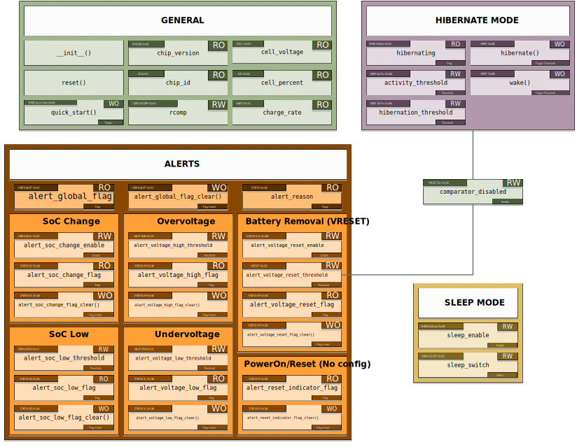

============
API Overview
============

.. currentmodule:: max1704x_smbus.core.MAX17048

The MAX17048 driver API is organized into functional groups based on the device's capabilities.

Primary API
===========

The Primary API provides access to general usage options and information.

Battery Monitoring
------------------

These properties provide real-time battery measurements (read-only):

.. autosummary::
    cell_voltage
    cell_percent
    charge_rate

.. code-block:: python

   from max1704x_smbus import MAX17048

   sensor = MAX17048()
   
   # Battery measurements
   print(f"Voltage: {sensor.cell_voltage} V")
   print(f"Charge level: {sensor.cell_percent} %")
   print(f"Charge rate: {sensor.charge_rate} %/hr")

Device Information
------------------

Read chip identification and version information (read-only):

.. autosummary::
    chip_id
    chip_version

.. code-block:: python

   print(f"Chip: 0x{sensor.chip_id:02X} v{sensor.chip_version}")

Configuration & Control
-----------------------

Configure device behavior and perform control operations:

.. autosummary::
    rcomp
    reset
    quick_start

Sleep API
=========

Control sleep status of the device. During sleep, measurements and alert 
monitoring are paused.

.. autosummary::
    sleep_enable
    sleep_switch

.. code-block:: python

    from max1704x_smbus import MAX17048
    
    sensor = MAX17048()
    sensor.sleep_enable = True
    
    # Check current voltage and voltage_high alert
    print(sensor.cell_voltage)              # 4.07625
    print(sensor.alert_voltage_high_flag)   # False

    # Let's force an alert to be triggered
    sensor.alert_voltage_high_threshold = 3.7
    sensor.alert_voltage_high_threshold = 5.0
    print(sensor.alert_voltage_high_flag)   # True

    # Entering sleep mode
    sensor.sleep_switch = True
    
    # Clear and check the alert flag (still in sleep mode)
    sensor.alert_voltage_high_flag_clear()
    print(sensor.alert_voltage_high_flag)   # True

    # Check the alert flag (after exiting sleep mode)
    sensor.sleep_switch = False
    print(sensor.alert_voltage_high_flag)   # False

.. _hibernation-mode:

Hibernate API
=============

.. autosummary::
    hibernating
    activity_threshold
    hibernation_threshold
    hibernate
    wake

Hibernation can be controlled automatically via thresholds or manually via 
methods, or a combination of both approaches.

**Automatic mode with thresholds:**

.. code-block:: python

    from max1704x_smbus import MAX17048
    
    sensor = MAX17048()

    sensor.activity_threshold = 0.08    # Exits hibernation if |OCV - CELL| > 80 mV
    sensor.hibernation_threshold = 20   # Enters hibernation if CRATE < 20 %/hr (for 6 min)

    if sensor.hibernating:
        print("Device in hibernation")

**Manual control:**

.. code-block:: python

    from max1704x_smbus import MAX17048

    sensor = MAX17048()

    sensor.wake()

    if some_condition:      # Force hibernation
        sensor.hibernate()

.. seealso::
    This can also affect the :ref:`analog comparator <analog-comparator>`.

Alerts API
==========

All items in the alerts API begin with ``alert_`` and follow the naming format ``alert_<type>_<element>``, except for :py:attr:`alert_reason`.

Global Alerts
-------------

.. autosummary::
    alert_global_flag
    alert_global_flag_clear
    alert_reason

Constants are available to mask :py:attr:`alert_reason`:

+-----------------------------------------------------------+
| :py:const:`~max1704x_smbus.core.ALERTFLAG_SOC_CHANGE`     |
+-----------------------------------------------------------+
| :py:const:`~max1704x_smbus.core.ALERTFLAG_SOC_LOW`        |
+-----------------------------------------------------------+
| :py:const:`~max1704x_smbus.core.ALERTFLAG_VOLTAGE_RESET`  |
+-----------------------------------------------------------+
| :py:const:`~max1704x_smbus.core.ALERTFLAG_VOLTAGE_LOW`    |
+-----------------------------------------------------------+
| :py:const:`~max1704x_smbus.core.ALERTFLAG_VOLTAGE_HIGH`   |
+-----------------------------------------------------------+
| :py:const:`~max1704x_smbus.core.ALERTFLAG_RESET_INDICATOR`|
+-----------------------------------------------------------+

.. code-block:: python

    from max1704x_smbus import MAX17048
    from max1704x_smbus.core import ALERTFLAG_SOC_LOW, ALERTFLAG_VOLTAGE_LOW, ALERTFLAG_VOLTAGE_HIGH

    sensor = MAX17048()

    if sensor.alert_reason & (ALERTFLAG_SOC_LOW | ALERTFLAG_VOLTAGE_LOW):
        print("Warning: Battery Low")
        # Handle low battery condition
    elif sensor.alert_reason & ALERTFLAG_VOLTAGE_HIGH:
        print("Critical: Overvoltage detected")
        # Handle overvoltage condition
    

SoC Change Alert
----------------

.. autosummary::
    alert_soc_change_enable
    alert_soc_change_flag
    alert_soc_change_flag_clear

Triggers when State of Charge (SoC) changes at least 1%.

.. code-block:: python

    from max1704x_smbus import MAX17048

    sensor = MAX17048()
    
    sensor.alert_soc_change_enable = True

    while True:
        if sensor.alert_soc_change_flag:
            print("SoC Changed!")
            sensor.alert_soc_change_flag_clear()

SoC Low Alert
-------------

.. autosummary::
    alert_soc_low_threshold
    alert_soc_low_flag
    alert_soc_low_flag_clear

Triggers when battery percentage falls below the configured threshold.

Overvoltage Alert
-----------------

.. autosummary::
    alert_voltage_high_threshold
    alert_voltage_high_flag
    alert_voltage_high_flag_clear

Triggers when battery voltage rises above the configured threshold.

Undervoltage Alert
------------------

.. autosummary::
    alert_voltage_low_threshold
    alert_voltage_low_flag
    alert_voltage_low_flag_clear

Triggers when battery voltage falls below the configured threshold.

.. _vreset:

Voltage Reset Alert (Battery Removal)
-------------------------------------

.. autosummary::
    alert_voltage_reset_enable
    alert_voltage_reset_threshold
    alert_voltage_reset_flag
    alert_voltage_reset_flag_clear

Triggers when battery voltage falls and rises again above the configured threshold, indicating a battery reconnection.

.. seealso::
    This can also be affected by the :ref:`analog comparator <analog-comparator>`.

Reset Indicator (Power-On / Reset)
----------------------------------

.. autosummary::
    alert_reset_indicator_flag
    alert_reset_indicator_flag_clear

Activated when powered up or reset, indicating the device still requires configuration.

.. _analog-comparator:
Analog Comparator
=================

The IC has a fast analog comparator and a slower digital ADC to detect battery removal and reinsertion (:ref:`Voltage Reset Alert <vreset>`).

This fast analog comparator can be disabled when the device enters :ref:`hibernation mode <hibernation-mode>` by setting the :py:attr:`comparator_disabled` bit. This saves approximately 0.5µA.

.. autosummary::
    comparator_disabled

| If the comparator is enabled, the IC takes 1ms to reset after the cell voltage (``VCELL``) rises above the threshold.
| Otherwise, the trigger relies on the digital ADC, taking 250ms to reset.

.. seealso::
    | Check the :ref:`Voltage Reset Alert <vreset>` and the :ref:`hibernation mode <hibernation-mode>`.
    | For more details, take a look at the ``VRESET`` register (``0x18``) in the datasheet.

